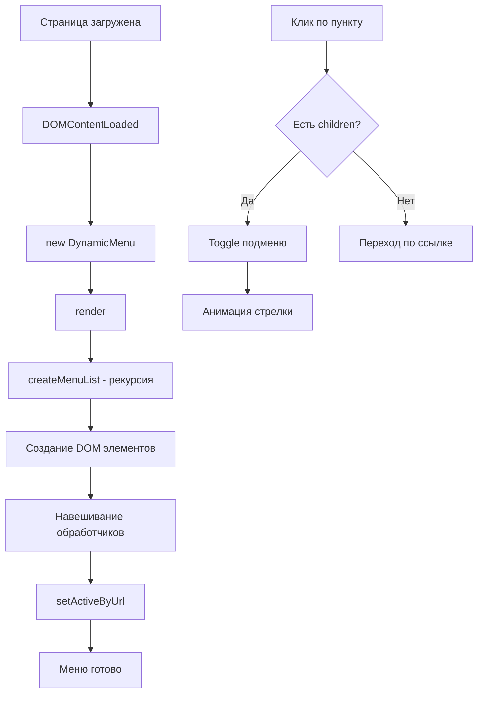

# Динамическое меню - описание кода

## Общая архитектура

Код реализует динамическое многоуровневое меню на чистом JavaScript, которое может:
- Рендериться из JSON-данных
- Поддерживать неограниченную вложенность пунктов
- Иметь иконки и активные состояния
- Адаптироваться под текущий URL

## Компоненты

### 1. Структура данных (menuData)
```javascript
const menuData = [
  { 
    label: "Главная",      // Отображаемый текст
    url: "/",              // Ссылка (опционально)
    icon: ".",            // Иконка (опционально)
    children: [...]        // Вложенные пункты (опционально)
  }
]
```

### 2. CSS стили

| Класс | Назначение |
|-------|------------|
| `.menu-list` | Контейнер для списка меню, убирает стандартные отступы |
| `.menu-item` | Каждый пункт меню, добавляет разделитель |
| `.menu-link` | Ссылка/элемент меню, стили при наведении и активном состоянии |
| `.link-content` | Группирует иконку и текст для правильного выравнивания |
| `.arrow` | Стрелка у пунктов с подменю, анимированное вращение |
| `.active` | Выделяет текущий активный пункт (синий фон) |

### 3. Класс DynamicMenu

#### Конструктор
```javascript
constructor(containerId, data)
```
- `containerId` - ID HTML элемента, куда будет вставлено меню
- `data` - массив с данными меню
- Вызывает `render()` для отрисовки

#### Методы

##### `render()`
- Очищает контейнер
- Создает корневой `<ul>` элемент
- Вставляет меню в DOM

##### `createMenuList(items)`
Рекурсивно создает структуру меню:

```javascript
createMenuList(items) {
  // Создает <ul>
  // Для каждого пункта:
  if (есть children) {
    // Создает:
    // - <div> с классом menu-link (кликабельный)
    // - Стрелку для открытия/закрытия
    // - Вложенный <ul> (рекурсивный вызов)
    // - Обработчик клика для toggle подменю
  } else {
    // Создает <a> с href={url}
  }
}
```

**Логика обработки вложенности:**
1. При клике на пункт с `children`:
   - Определяется текущее состояние (открыто/закрыто)
   - Переключается `display: none/block` у вложенного списка
   - Вращается стрелка на 90 градусов

##### `setActiveByUrl(currentUrl)`
- Находит все элементы `.menu-link`
- Сравнивает их href с текущим URL
- Добавляет класс `active` для совпадающих

## Поток выполнения



## Особенности реализации

### 1. Рекурсивная отрисовка
Метод `createMenuList()` вызывает сам себя для каждого уровня вложенности, что позволяет создавать меню любой глубины.

### 2. Динамическое создание элементов
Все элементы создаются через `document.createElement()`, а не через строки HTML, что:
- Безопаснее (защита от XSS)
- Легче управлять событиями
- Удобнее для сложной логики

### 3. Обработка кликов
```javascript
div.addEventListener('click', (e) => {
  e.stopPropagation(); // Предотвращает всплытие
  // Логика открытия/закрытия
});
```

### 4. Активный пункт
```javascript
setActiveByUrl(window.location.pathname)
```
Автоматически подсвечивает пункт, соответствующий текущему URL.

## Пример использования

```javascript
// Инициализация
const menu = new DynamicMenu('mainMenu', menuData);
menu.setActiveByUrl('/catalog/electronics/phones');

// Асинхронная загрузка с сервера
async function loadMenu() {
  try {
    const response = await fetch('/api/menu');
    const data = await response.json();
    new DynamicMenu('mainMenu', data);
  } catch (error) {
    console.error('Ошибка загрузки:', error);
    // Fallback на статичное меню
    new DynamicMenu('mainMenu', [{ label: "Ошибка", url: "#" }]);
  }
}
```

## Возможные проблемы и решения

| Проблема | Решение |
|----------|---------|
| Меню не отображается | Проверить наличие элемента с указанным ID |
| Стрелка не вращается | Убедиться, что CSS трансформации не переопределены |
| Не работает активное состояние | Проверить, что `setActiveByUrl()` вызван после рендера |
| Вложенные меню не открываются | Проверить, что обработчик клика навешан на правильный элемент |

## Кастомизация

### Изменение стилей
```css
/* Смена цвета активного пункта */
.menu-link.active {
  background: #28a745;  /* Зеленый вместо синего */
  color: white;
}

/* Анимация выезжания подменю */
.menu-item > ul {
  transition: all 0.3s ease;
  overflow: hidden;
}
```

### Добавление анимации
```javascript
// В обработчике клика
childUl.style.maxHeight = isOpen ? '0' : childUl.scrollHeight + 'px';
childUl.style.overflow = 'hidden';
```

## Производительность

- **Сложность отрисовки**: O(n) где n - количество пунктов
- **Память**: Каждый пункт создает DOM-элементы, для больших меню (>1000 пунктов) рекомендуется виртуализация
- **События**: Использует делегирование через замыкания, что оптимально для небольших меню