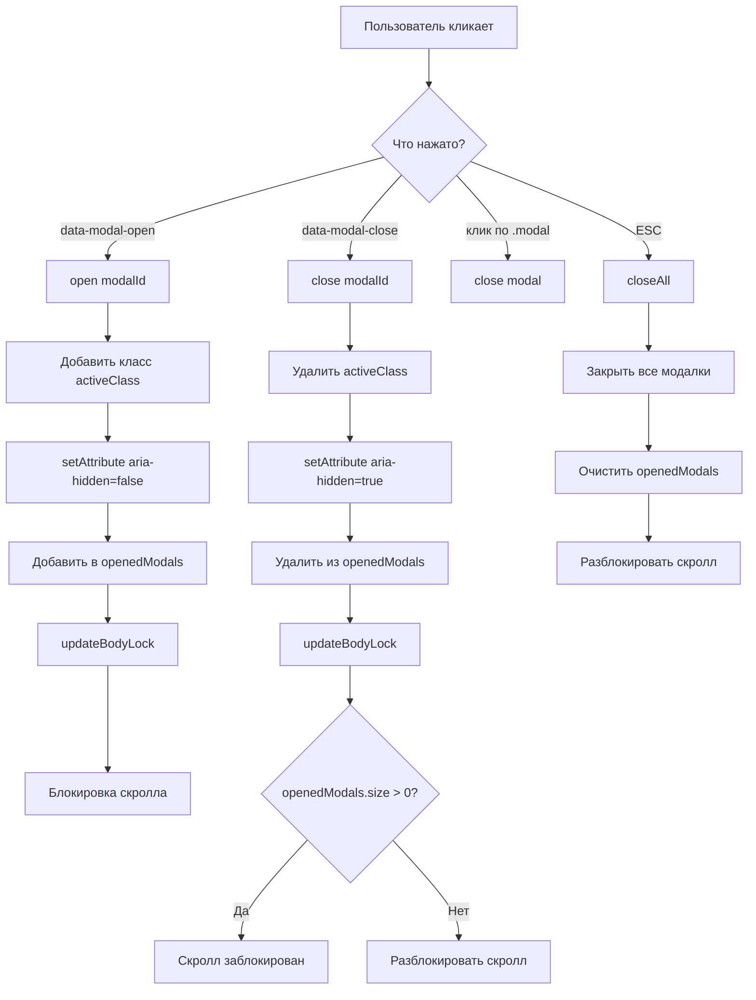

# ModalManager - управление модальными окнами

## 📋 Общая архитектура

Класс `ModalManager` реализует универсальное управление модальными окнами на чистом JavaScript. Он позволяет:
- Открывать/закрывать модальные окна по data-атрибутам
- Блокировать скролл страницы при открытой модалке
- Закрывать по клику на фон (оверлей) или клавише ESC
- Работать с несколькими модалками одновременно
- Поддерживать ARIA-атрибуты для доступности

## 🔧 Компоненты

### 1. Конфигурация

| Свойство | Значение по умолчанию | Назначение |
|----------|---------------------|------------|
| `modalSelector` | `.modal` | Селектор для поиска модальных окон |
| `openSelector` | `[data-modal-open]` | Селектор кнопок открытия |
| `closeSelector` | `[data-modal-close]` | Селектор кнопок закрытия |
| `activeClass` | `is-open` | Класс активной модалки |
| `bodyLockClass` | `modal-lock` | Класс для блокировки скролла body |

### 2. Состояние

| Свойство | Тип | Назначение |
|----------|-----|------------|
| `openedModals` | `Set` | Хранит ссылки на открытые модальные окна (без дублей) |
| `isInitialized` | `boolean` | Флаг инициализации (защита от повторного вызова) |

### 3. Структура HTML

```html
<!-- Кнопка открытия -->
<button data-modal-open="myModal">Открыть модалку</button>

<!-- Модальное окно -->
<div id="myModal" class="modal" aria-hidden="true">
    <div class="modal-content">
        <button data-modal-close="myModal">✕</button>
        <h2>Заголовок</h2>
        <p>Содержимое модального окна</p>
    </div>
</div>
```

## 🔄 Поток выполнения

### Инициализация
```javascript
document.addEventListener('DOMContentLoaded', () => {
    const modalManager = new ModalManager();
    modalManager.init();
});
```

### Жизненный цикл модального окна



## 📝 Детальное описание методов

### `init()`
Инициализирует менеджер:
- Проверяет `isInitialized` для защиты от повторной инициализации
- Навешивает глобальные обработчики событий:
  - `click` - для обработки кликов
  - `keydown` - для обработки нажатий клавиш

### `getModal(target)`
Вспомогательный метод для получения DOM-элемента модалки:
```javascript
getModal(target) {
    if (typeof target === 'string') return document.getElementById(target);
    if (target instanceof HTMLElement) return target;
    return null;
}
```

### `open(target)`
Открывает модальное окно:
```javascript
open(target) {
    const modal = this.getModal(target);
    if (!modal || modal.classList.contains(this.activeClass)) return;
    
    modal.classList.add(this.activeClass);      // Показываем модалку
    modal.setAttribute('aria-hidden', 'false'); // Для скринридеров
    this.openedModals.add(modal);               // Сохраняем в список
    this.updateBodyLock();                      // Блокируем скролл
}
```

**Логика:**
1. Проверяет существование модалки и не открыта ли она уже
2. Добавляет класс активности (обычно `is-open` или `show`)
3. Обновляет ARIA-атрибут для доступности
4. Добавляет модалку в Set открытых
5. Блокирует скролл страницы (если это первая открытая модалка)

### `close(target)`
Закрывает конкретное модальное окно:
```javascript
close(target) {
    const modal = this.getModal(target);
    if (!modal || !modal.classList.contains(this.activeClass)) return;
    
    modal.classList.remove(this.activeClass);
    modal.setAttribute('aria-hidden', 'true');
    this.openedModals.delete(modal);
    this.updateBodyLock();
}
```

### `closeAll()`
Закрывает все открытые модальные окна:
```javascript
closeAll() {
    document.querySelectorAll(this.modalSelector).forEach(modal => {
        modal.classList.remove(this.activeClass);
        modal.setAttribute('aria-hidden', 'true');
    });
    this.openedModals.clear();
    this.updateBodyLock();
}
```

### `updateBodyLock()`
Управляет блокировкой скролла страницы:
```javascript
updateBodyLock() {
    document.body.classList.toggle(
        this.bodyLockClass, 
        this.openedModals.size > 0
    );
}
```
- Если есть открытые модалки → добавляет класс `modal-lock` к body
- Если нет открытых → убирает этот класс

### `handleClick(e)`
Главный обработчик кликов с логикой определения действий:

```javascript
handleClick(e) {
    // 1. Кнопка открытия
    const openBtn = e.target.closest(this.openSelector);
    if (openBtn) {
        this.open(openBtn.dataset.modalOpen);
        return;
    }

    // 2. Кнопка закрытия
    const closeBtn = e.target.closest(this.closeSelector);
    if (closeBtn) {
        this.close(closeBtn.dataset.modalClose);
        return;
    }

    // 3. Клик по фону (оверлею)
    const modal = e.target.closest(this.modalSelector);
    if (modal && e.target === modal) {
        this.close(modal);
    }
}
```

**Важно:** Клик по фону срабатывает только если кликнут именно на элементе `.modal`, а не на его содержимом.

### `handleKeydown(e)`
Обрабатывает нажатия клавиш:
```javascript
handleKeydown(e) {
    if (e.key === 'Escape' && this.openedModals.size > 0) {
        this.closeAll();
    }
}
```
- При нажатии ESC закрывает ВСЕ открытые модалки

## 🎨 CSS для корректной работы

```css
/* Базовая стилизация модалки */
.modal {
    display: none;
    position: fixed;
    top: 0;
    left: 0;
    width: 100%;
    height: 100%;
    background: rgba(0, 0, 0, 0.5);
    z-index: 1000;
}

.modal.is-open {
    display: flex;
    align-items: center;
    justify-content: center;
}

.modal-content {
    background: white;
    padding: 20px;
    border-radius: 8px;
    max-width: 500px;
    width: 90%;
}

/* Блокировка скролла */
.modal-lock {
    overflow: hidden;
}
```

## 🚀 Пример использования

### HTML
```html
<!-- Кнопки открытия -->
<button data-modal-open="loginModal">Войти</button>
<button data-modal-open="registerModal">Регистрация</button>

<!-- Модалка логина -->
<div id="loginModal" class="modal" aria-hidden="true">
    <div class="modal-content">
        <button data-modal-close="loginModal">✕</button>
        <h2>Вход в систему</h2>
        <form>
            <input type="text" placeholder="Логин">
            <input type="password" placeholder="Пароль">
            <button type="submit">Войти</button>
        </form>
    </div>
</div>

<!-- Модалка регистрации -->
<div id="registerModal" class="modal" aria-hidden="true">
    <div class="modal-content">
        <button data-modal-close="registerModal">✕</button>
        <h2>Регистрация</h2>
        <form>
            <input type="text" placeholder="Имя">
            <input type="email" placeholder="Email">
            <input type="password" placeholder="Пароль">
            <button type="submit">Зарегистрироваться</button>
        </form>
    </div>
</div>
```

### JavaScript
```javascript
// Автоматическая инициализация
document.addEventListener('DOMContentLoaded', () => {
    const modalManager = new ModalManager();
    modalManager.init();
    
    // Ручное управление из консоли (для отладки)
    window.modalManager = modalManager;
});

// Открыть модалку программно
modalManager.open('loginModal');

// Закрыть модалку программно
modalManager.close('loginModal');

// Закрыть все модалки
modalManager.closeAll();
```

## ⚙️ Кастомизация

### Изменение селекторов и классов
```javascript
const modalManager = new ModalManager();
modalManager.modalSelector = '.custom-modal';
modalManager.openSelector = '[data-custom-open]';
modalManager.closeSelector = '[data-custom-close]';
modalManager.activeClass = 'visible';
modalManager.bodyLockClass = 'no-scroll';
modalManager.init();
```

### Добавление анимации
```css
.modal {
    transition: opacity 0.3s ease;
    opacity: 0;
}

.modal.is-open {
    opacity: 1;
}

.modal-content {
    transform: scale(0.9);
    transition: transform 0.3s ease;
}

.modal.is-open .modal-content {
    transform: scale(1);
}
```

### Расширение функциональности
```javascript
class ExtendedModalManager extends ModalManager {
    // Добавляем логирование
    open(target) {
        console.log(`Открытие модалки: ${target}`);
        super.open(target);
    }
    
    // Добавляем callback на закрытие
    close(target) {
        const modal = this.getModal(target);
        if (modal) {
            const onClose = modal.dataset.onClose;
            if (onClose && window[onClose]) {
                window[onClose]();
            }
        }
        super.close(target);
    }
}
```

## 🔍 Особенности реализации

### 1. Использование Set для openedModals
```javascript
this.openedModals = new Set(); // Не хранит дубликаты
```
- Гарантирует уникальность элементов
- Быстрая проверка наличия модалки

### 2. Защита от повторной инициализации
```javascript
if (this.isInitialized) return;
this.isInitialized = true;
```
Предотвращает повторное навешивание обработчиков

### 3. Делегирование событий
Используется `e.target.closest()` вместо прямого обработчика на каждом элементе, что:
- Экономит память
- Работает с динамически добавленными элементами
- Упрощает код

### 4. ARIA-атрибуты
```javascript
modal.setAttribute('aria-hidden', 'true');  // для скрытых
modal.setAttribute('aria-hidden', 'false'); // для видимых
```
Повышает доступность для скринридеров

## 🐛 Возможные проблемы и решения

| Проблема | Причина | Решение |
|----------|---------|---------|
| Модалка не открывается | Нет элемента с указанным ID | Проверить совпадение `data-modal-open` и `id` |
| Не закрывается по фону | Вложенные элементы перехватывают клик | Убедиться, что `.modal-content` не занимает весь экран |
| Скролл не блокируется | Не задан CSS для `.modal-lock` | Добавить `.modal-lock { overflow: hidden; }` |
| Дублирование обработчиков | Повторный вызов `init()` | Уже защищено флагом `isInitialized` |
| ESC закрывает только одну модалку | Нужно закрывать все | Метод `closeAll()` закрывает все сразу |

## 📊 Производительность

- **Память**: O(n) где n - количество открытых модалок
- **События**: Всего 2 глобальных обработчика независимо от количества модалок
- **DOM операции**: Минимальные, только при открытии/закрытии

## 🎯 Преимущества подхода

1. **Низкая связанность** - менеджер не знает о структуре модалок
2. **Расширяемость** - легко добавить новые методы
3. **Доступность** - встроенная поддержка ARIA
4. **Универсальность** - работает с любыми модалками, не требуя изменений в HTML
5. **Отладка** - доступен из консоли в development режиме